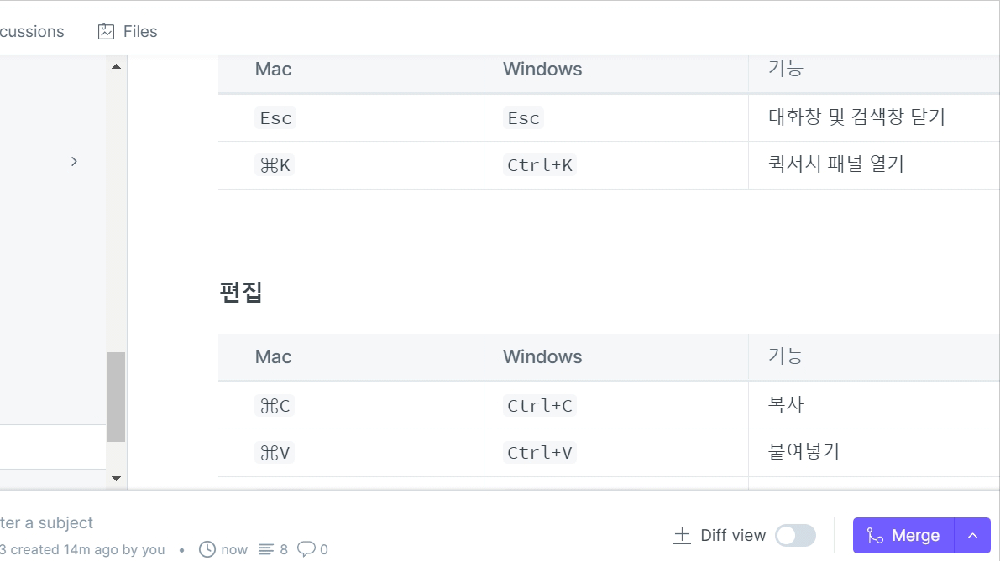

# 3-2. 블록

콘텐츠 블록은 명령 팔레트를 열어 추가할 수 있습니다.

<figure><figcaption></figcaption></figure>

콘텐츠 블록의 종류는 다음과 같습니다.

* [헤딩](heading.md)
* [단락](paragraph.md)
* [카드](undefined.md)
* [순서가 없는 목록](unordered\_list.md)
* [순서가 있는 목록](ordered\_list.md)
* [태스크 목록](task\_list.md)
* [힌트](hint.md)
* [인용](quote.md)
* [코드 블럭](code\_block.md)
* [파일 삽입](insert\_files.md)
* [이미지 삽입](insert\_images.md)
* [URL 삽입](url.md)
* [표](table.md)
* [탭](tabs.md)
* [확장형 블록](expandable.md)
* [드로잉](drawing.md)
* [Math & TeX](math-and-tex.md)
* [API 메서드](api.md)
* [OpenAPI](openapi.md)
* [페이지 링크](page\_link.md)

